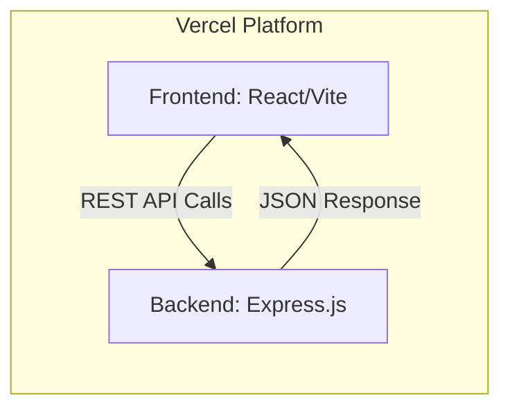

# Customer Management Dashboard
### A Full-Stack Modern Web Application

**[🔗 Live Demo](https://customer-management-dashboard-c2y5.vercel.app/)** | **[📂 GitHub Repository](https://github.com/Abhishekmishrz/customer-management-dashboard)**

A professional, responsive, and high-performance customer management system built with the **MERN (React/Node/Express)** stack. This application provides a seamless interface for administrators to manage customer records with real-time feedback and a premium dark-themed aesthetic.

---

## 🚀 Key Features

- **Full-Stack CRUD Operations**: Complete create, read, and delete functionality for customer records.
- **Premium UI/UX**: Modern dark-theme design featuring glassmorphism, animated background gradients, and smooth transitions.
- **Real-Time Data Management**: In-memory storage on the backend for fast performance without database overhead.
- **Smart Validation**: 
  - Prevents duplicate entries based on email addresses.
  - Ensures all fields (Name, Email, Phone) are populated before submission.
- **User Feedback System**: Custom bottom-center snackbar notifications for all success and error actions.
- **Responsive Architecture**: Fully optimized for mobile, tablet, and desktop viewports.
- **Vercel Optimized**: Configured for modern monorepo deployment using Vercel's multi-service architecture.

---

## 🛠 Technology Stack

### Frontend
- **React.js**: Functional components and Hooks (`useState`, `useEffect`) for state management.
- **Vite**: Ultra-fast build tool and development server.
- **Vanilla CSS3**: Custom design system featuring CSS variables, Flexbox/Grid, and keyframe animations.
- **Lucide Icons**: Clean, scalable vector icons.

### Backend
- **Node.js**: Asynchronous JavaScript runtime.
- **Express.js**: Lightweight framework for building RESTful APIs.
- **CORS**: Middleware for secure cross-origin resource sharing.

### Infrastructure & Deployment
- **GitHub**: Source control and version history.
- **Vercel**: Automated CI/CD deployment with serverless functions.

---

## 🏗 System Architecture



---

## 📂 Project Structure

```text
customer-management-dashboard/
├── backend/                # Express.js Server
│   ├── server.js           # API logic and routes
│   └── package.json        # Backend dependencies
├── frontend/               # React.js Application
│   ├── src/                # Components and Styles
│   ├── vite.config.js      # Development proxy settings
│   └── package.json        # Frontend dependencies
├── vercel.json             # Vercel monorepo configuration
└── README.md               # Project documentation
```

---

## 💻 Local Setup & Installation

### 1. Prerequisites
- Node.js (v18 or higher)
- npm (v9 or higher)

### 2. Backend Setup
```bash
cd backend
npm install
npm run dev
```
The server will start on `http://localhost:5000`.

### 3. Frontend Setup
```bash
# Open a new terminal
cd frontend
npm install
npm run dev
```
The application will be available at `http://localhost:5173`.

---

## 📡 API Documentation

| Method | Endpoint | Description | Payload |
| :--- | :--- | :--- | :--- |
| **GET** | `/api/customers` | Retrieve all customer records | N/A |
| **POST** | `/api/customers` | Create a new customer entry | `{ name, email, phone }` |
| **DELETE** | `/api/customers/:id` | Remove a record by unique ID | N/A |

---

This project is configured for **Vercel** for high availability and serverless performance.

- **Frontend Build**: Vite + React
- **Backend Build**: Express Serverless Function
- **Live URL**: [https://customer-management-dashboard-c2y5.vercel.app/](https://customer-management-dashboard-c2y5.vercel.app/)

---

## 👨‍💻 Developed By
**Abhishekmishrz**
